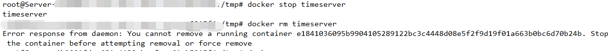
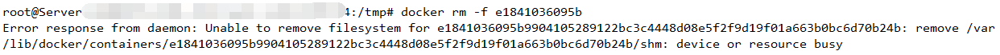

## Docker 无法停止容器,rm掉以后 启动提示网络被占用

### 0x0001 起因
#### 1.1 
**在部署新容器之前，需要停止并删除旧版本容器，使用stop 和 rm 后，出现如下图所示的错误**

**重新使用 Docker PS 后发现，原容器并未终止，随后使用Kill 命令发现也无法停止容器**

### 0x0002 解决

#### 1.2 强行删除容器
**使用docker rm -f id 强行移除容器，报出如下错误**

**但是容器是正常移除的**

#### 1.3 出现错误

**当启动新的容器时，会发现docker报错，原因是网络被占用**
错误如下:
```
docker: Error response from daemon: endpoint with name timeserver already exists in network host.
```

按道理来说，应该找到占用的端口并且删除掉，网上给出的处理建议是如下：
参考文档：[docker 容器无法停止](https://blog.csdn.net/weixin_39800144/article/details/79352184)
```
清理此容器的网络占用

格式：docker network disconnect --force 之前容器使用的网络模式 容器名称

示例：docker network disconnect --force bridge mysql1

4.简查是否还有同名容器占用

格式：docker network inspect 网络模式
示例：docker network inspect bridge
```

**由于当时情况紧急，并没有使用上述方法处理,使用了如下方法**
```
1、停止所有容器
docker stop $(docker ps -q)
2、重启docker 
service docker restart
3、启动所有容器
docker start $(docker ps -aq)
4、删除此前遗留的容器目录
cd /var/lib/docker/containers/
rm -rf e1841036095b9904105289
```